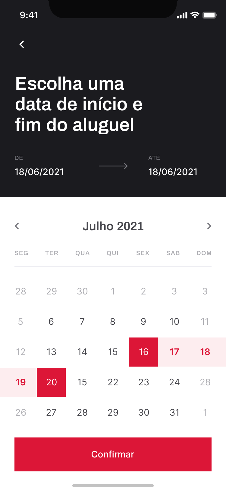
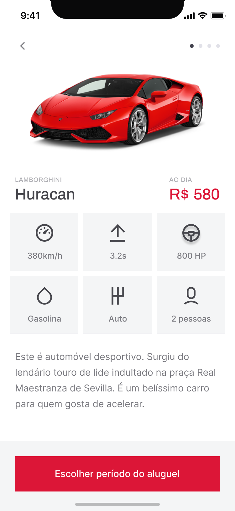
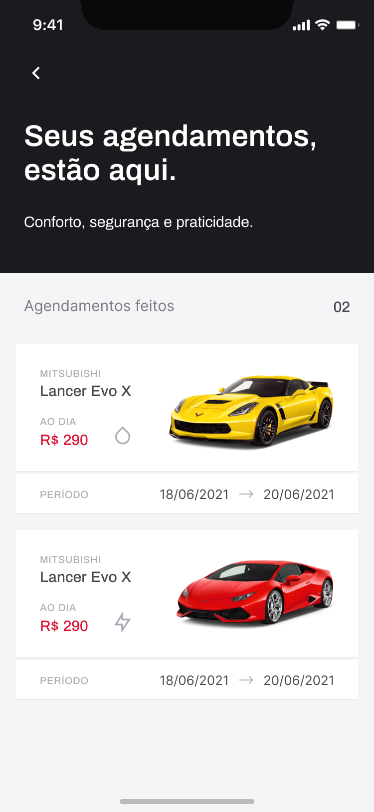

# RentX


## 💻 Sobre o projeto
  Rentx é um aplicativo para locação de carros.
  

[Projeto feito em conjunto com o treinamento IGNITE da RocketSeat ](https://rocketseat.com.br/)

## Features

- [x] Escolher Carros apartir de uma lista de carros
- [x] Ver informaçoes referente ao carro como qual tipo de combustivel,e quantas pessoas cabem.
- [x] Agendar o periodo de aluguel do carro utilizando um calendario para selecionar periodo

## 🎨 Layout

O layout da aplicação está disponível no Figma:

https://www.figma.com/file/4ojyGi2mGuQaGK0sUHMAqB/RentX-Ignite?node-id=0%3A1

layout disponibilizado pela RocketSeat.

## 🚀 Como executar o projeto (dev) / Getting Started

Clone Project ]
```
$ git clone https://github.com/AndreBento/ignite-mobile-rentx.git
```

```
# Install the dependencies
$ yarn

# Run the Expo server
$ expo start

# Run the Json Server
$ yarn api
```


## 🛠 Tecnologias

As seguintes ferramentas foram usadas na construção do projeto:

#### **Website**  ([React](https://reactjs.org/)  +  [TypeScript](https://www.typescriptlang.org/))


-   **[Axios](https://github.com/axios/axios)**
-   **[JSON Server](https://github.com/typicode/json-server)**
-   **[ReactNative](https://reactnative.dev/)**
-   **[TypeScript](https://www.typescriptlang.org/)**
-   **[Expo](https://expo.io/)**
-   **[Styled Component](https://styled-components.com/)**


## Imagens 
<h3 >
  Selecionando Data
</h3>
 

  

<h3>
  Detalhes do Carro
 </h3>
    
 


<h3>
  Agendamentos
</h3>
  

### Autor
---


 
 <br />
 <sub><b>Flavio Segundo</b></sub></a> <a href="https://github.com/Fpos0">🚀


Feito por Flavio Segundo 👋🏽 Entre em contato!

[](https://www.linkedin.com/in/flavio-p-o-segundo-889b25108/) 
| 
[](mailto:flaviofpos@hotmail.com)

## License
[MIT](https://choosealicense.com/licenses/mit/)
